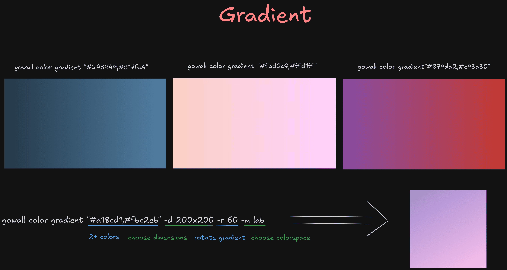

# Generate gradients

You know what a gradient is, so its pretty self explanatory. The gradient command gives you the options to control the dimensions, direction (rotation), and color blending method. The gradients all linear.



You can give 2+ colors to create a gradient. 
```bash
gowall color gradient "#392d69,#b57bee"

gowall color gradient "#392d69,#b57bee,#ffffff"

gowall color gradient "#392d69,#b57bee,#ffffff" -r vertical -m lab -d 1920x1080
gowall color gradient "#392d69,#b57bee,#ffffff" -r 270 -m lab -d 1920x1080
```

You can pass colors in any format that `gowall` understands (for example `hex`, `rgb`, `hsl`, `lab`) as shown in [here](./convert.md). Separate multiple colors with commas.

## Usage & Options

➤ **Dimensions**

The `-d` (or `--dimensions`) flag specifies the output image dimensions.

- **Format**: `WIDTHxHEIGHT` (e.g., `1920x1080`)
- **Default**: If not specified, uses `1920x1080`

```bash
gowall color gradient "#392d69,#b57bee" -d 1920x1080

gowall color gradient "#392d69,#b57bee,#ffffff" -d 800x600
```

➤ **Rotation**

The `-r` (or `--rotation`) flag controls the gradient direction.

- **Values**: `vertical` or `horizontal` or a degree angle `0-360`
- **Default**: If not specified, the gradient is 0 degrees (horizontal)

```bash
# Vertical gradient (top to bottom)
gowall color gradient "#392d69,#b57bee" -r vertical

# Horizontal gradient (left to right)
gowall color gradient "#392d69,#b57bee" -r horizontal

# rotate the gradient 270 degrees
gowall color gradient "#392d69,#b57bee" -r 270
```

➤ **Method**

The `-m` (or `--method`) flag specifies the color space used for blending the colors before converting back to RGB. Different color spaces can produce different gradient appearances.

- **Values**: `rgb`, `hcl`, `lab`, `hsv`, `luv`, `luvlch`
- **Default**: If not specified, uses a default method

```bash
# Blend using LAB color space
gowall color gradient "#392d69,#b57bee,#ffffff" -m lab

# Blend using HSV color space
gowall color gradient "#392d69,#b57bee" -m hsv

# Full example with all options
gowall color gradient "#392d69,#b57bee,#ffffff" -r vertical -m lab -d 1920x1080
```

