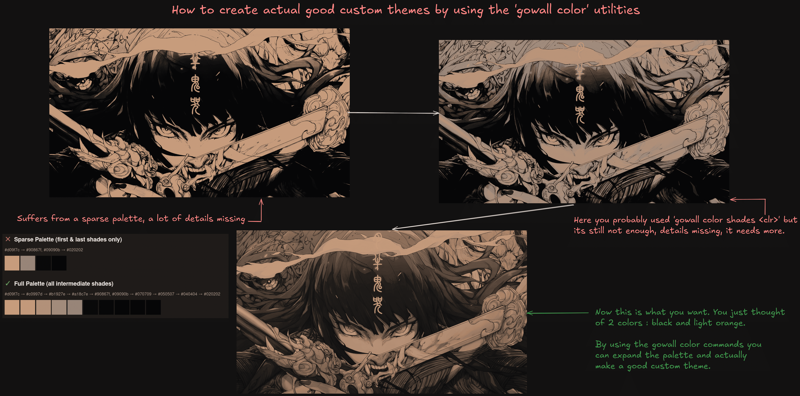

# Create good custom themes by using the color utilities

Most people just use the default themes bundled with gowall via `gowall list`. You know catppuccin,gruvbox.nord. 
They get boring quickly and you cant modify the result. Custom themes allow the following : 

1) Imagine some colors and use the color utilities to pad out the colors to create a theme.

2) Modify existing themes to remove colors you dont like in the image and add accent colors.