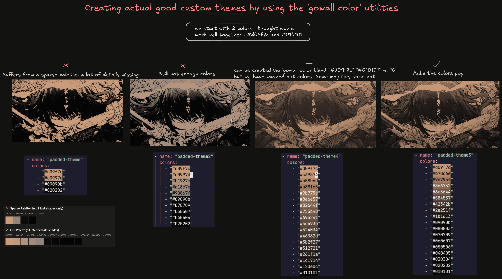
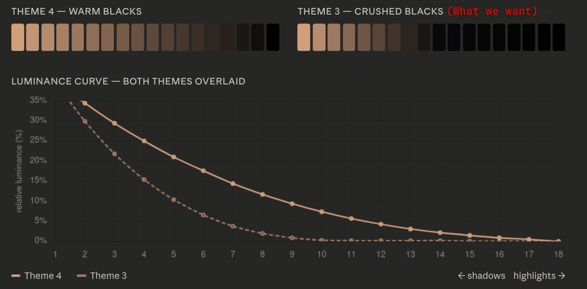

# Create good custom themes by using the color utilities

Most people just use the default themes bundled with gowall via `gowall list`. You know catppuccin,gruvbox.nord. 
They get boring quickly and you cant modify the result. Custom themes allow the following : 

1) Imagine some colors and use the color utilities to pad out the colors to create a theme.

You pad out the colors by using `gowall tint/blend` and other cmds. I'm sure many attempts will output washed out colors, so 
you gotta give them a little pop at the end. In the above example i make everything above especially the blacks.

You see the steep dropoff in theme3? you need that to get a sharp true black, before with the blend it  warm and brown-tinted.

2) Modify existing themes to remove colors you dont like in the image and add accent colors.c