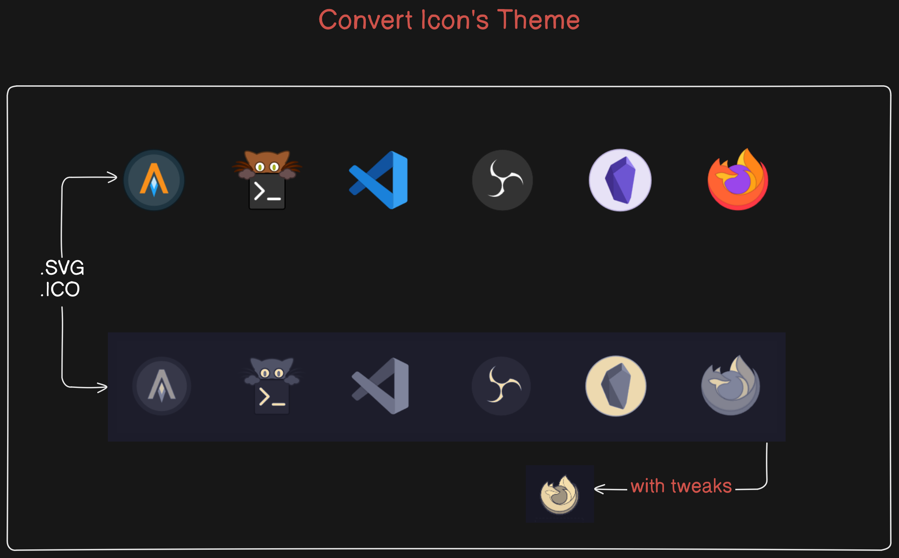

# Convert an Icons's Theme
We will take advantage of gowall's support for `stdin` and `stdout`,familiarize yourself with how gowall does that before attempting this, check it out [here]




## SVG Icons

### Gowall and Inkscape SVG

Here is a 1-liner of how to use gowall to recolor the icons and inkscape to transform raster data to vector data.  
Tweak the `--colors` flag in inkscape for more detail.

```bash
rsvg-convert -b none -f png input.svg | gowall convert - - -t <theme> | inkscape --pipe --trace-bitmap --colors 10 --export-plain-svg=out.svg
```

So why use inkscape? Well having tried out `potrace` which only works for black/white images, `vtracer` which was disappointing in the result, i'm not really left with many options.

### Hacky trick fake SVG

This is a trick that's used by a lot of these "png to svg" converters you see online. You just embed data as base64 inside the SVG.It's appearance looks like an svg, but it lost the scalability svg's have. So i call that a fake SVG.

The only way to really transform raster data to vector data is to trace it with a vector graphics editor (inkscape,krita).
Change the `width` and `height` accordingly if the svg is pixelated.

```bash
 rsvg-convert -b none -f png ~/Pictures/svg/firefox.svg \
  | gowall convert - - -t <theme> \
  | base64 -w 0 \
  | awk 'BEGIN {
           print "<svg xmlns=\"http://www.w3.org/2000/svg\" xmlns:xlink=\"http://www.w3.org/1999/xlink\">"
           print "  <image xlink:href=\"data:image/png;base64," 
         }
         { printf "%s", $0 }
         END { print "\" width=\"64px\" height=\"64px\"/></svg>" }' > ~/Pictures/svg/output.svg
```

### Use a small 1b paramaters model


Setup the [starvector](https://github.com/joanrod/star-vector) model. Then you can pass it gowall's image data and let it do the svg tracing.
The results are pretty decent as well.


## ICO Icons

You can use anything to feed to transform that `.ico` into one of the common image formats then just feed it into gowall.
If using imagemagick then tweak the `-resize` flag to your liking.

```
magick convert c.ico png:- | gowall convert - - -t catppuccin | magick convert - -resize 128x128 ~/Pictures/final.ico
```