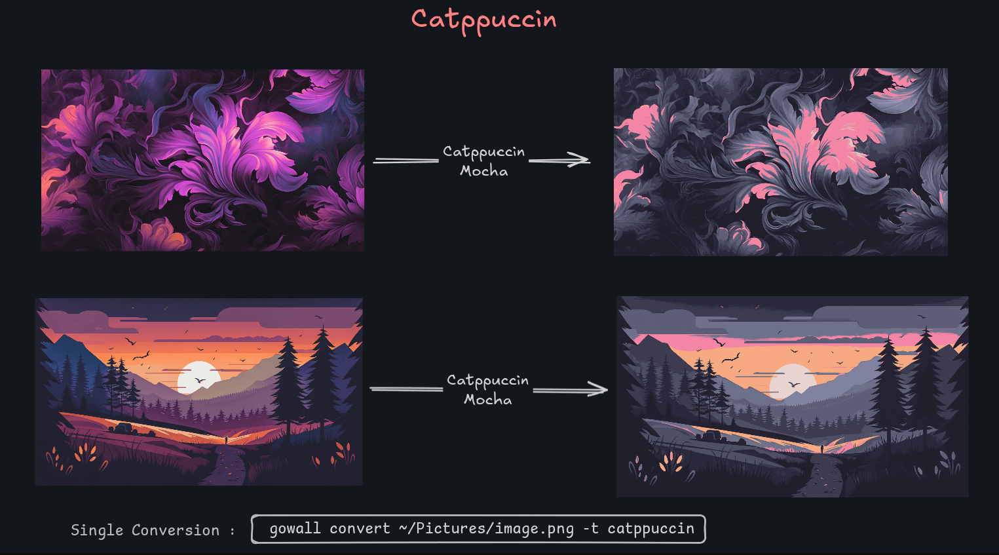
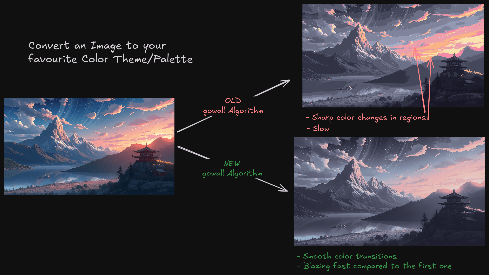

# Convert Wallpaper's Theme

:::danger IMPORTANT
(A new Algorithm is available `50%  faster` and far more `smooth` than the old one. Available in  Version `v.0.2.0`) : [click here](#new-algorithm-v020) to check out the differences. (It's the Default from `v.0.2.0` and onwards)
:::

 ➤ `Singe conversion` 

Convert any image to your favourite color scheme. Do `gowall list` for a list of available themes

  ```bash
    gowall convert path/to/img.png -t <theme-name>
  ```


Notes 🗒️ :

:::info
- `path/to/img.png` does not have to be an absolute path. You can use a relative path with the `~` ex. `~/Pictures/img.png` 
- `gowall list` shows the 25 built in themes along with any custom theme you created in `~/.config/gowall/config.yml`
- `-t` accepts a `.json` file with hex colors in the runtime see more info [here](../scripts.md#load-a-theme-dynamically-in-the-runtime-via-json-file)
:::

<br />

 ➤ `Batch conversion`

Processes more than 1 image at a time.

   ```bash
     gowall convert -b path/img.png,path/im2.png -t <theme-name>
   ```
⚠️ Do not leave any white spaces between the comma `,`

<br />


 ➤ `Convert a whole Directory`

   Use the `#` delimiter to convert every image file under that directory.
   
   ```bash
    gowall convert ~/Pictures/# -t catppuccin

    gowall invert ~/Pictures/test/# 
   ```
Notes 🗒️ :

:::info
 Only `png` `jpeg` `jpg` `webp` images will be converted any other directory or  file will be ignored
:::

## New Algorithm v.0.2.0



As you can see the new backend for color correction offers big improvements in :
1. `speed`
2. `smoothness` (getting rid of the sharp color changing)

### Use the old backend

Optionally, if some users want to use the old backend, they can by using specifying the option in `~/.config/gowall/config.yml`. It should
be at the top level where `themes:` is.

```yml title="~/.config/gowall/config.yml"
ColorCorrectionBackend : nn
```
