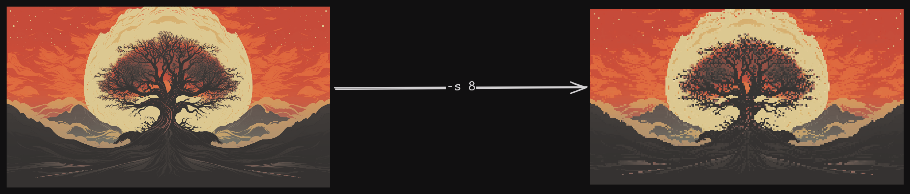
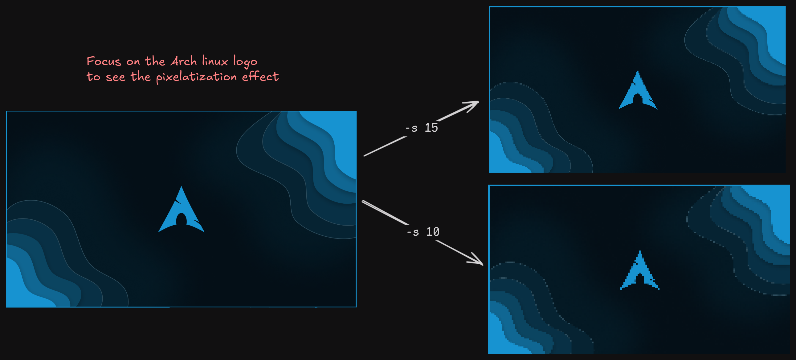

# Convert Image to Pixel art

1.  `Singe conversion`

Convert an image to pixel art by applying a pixelation effect.

  ```bash
    gowall pixelate ~/Pictures/img.png -s 15
  ```

The `-s` is the `scale` flag, an integer from [1-25]. The higher the number the less pixelated (blocky) the image is.
The lower you set it the more the pixel effect will become apparent. Start from 25 and decrement it slowly till you get to the desired number. 

:::tip
The higher resolution image you have, the lower the `scale` flag must be set.
:::


\
\



