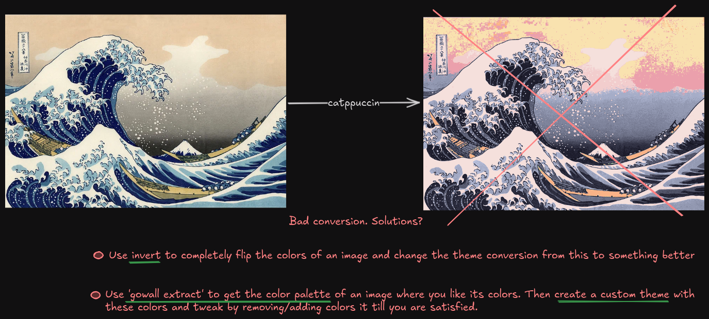
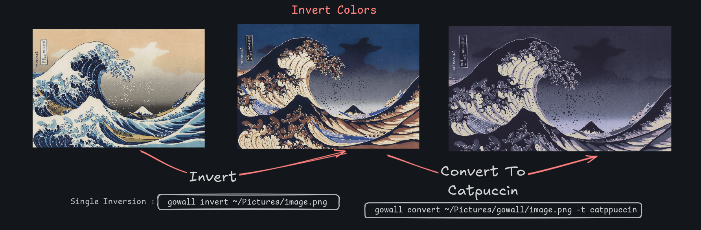
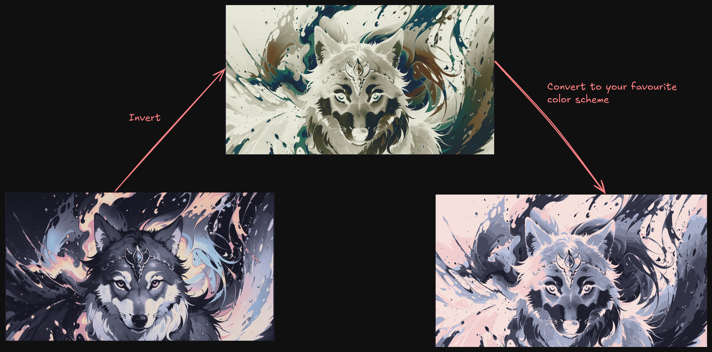

# Invert Colors

As the name suggests invert, inverts the colors of an image, ex. white --> black.

   ```bash
    gowall invert path/to/img.png
    gowall invert -b path/img.png,path/img2.png
    gowall invert ~/Pictures/test/# 
   ```
The `3rd` options inverts all images under the `~/Pictures/test` directory.

### Scenario where you want to use it
Lets say you just did `gowall convert ~/img.png -t catppuccin` and you were not satisfied by the theme conversion.
Invert helps you completely flip the colors of the original image and when you do `gowall convert ~/img.png -t catppuccin`
again the result will be entirely different.

Lets see an example so you can understand what i mean visually.

So we got an image we want to convert to the catppuccin theme, but the end result does not look like a catppuccin image.
Well the colors on the image use colors from the catppuccin color palette but where is the signature purple dark colors?
Lets fix that 🔨. 



- Lets invert those colors and try converting to `catppuccin color scheme` again. Now after inverting the image we convert that image 
to a catppuccin theme and boom! looking good in my signature yellow-catpuccin theme :) 



\
\

### More Visual Examples

