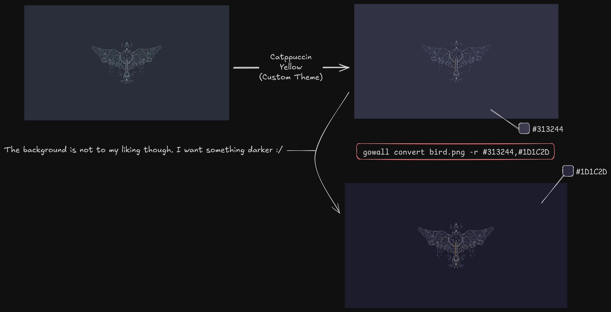

# Replace a specific color in an Image

As the title suggests you can use a color picker to select a color in an image and replace it with something else.
Maybe the image is just fine and you want to change the background which consists of a single color.

```bash
gowall convert ~/Pictures/bird.png -r #313244,#1D1C2D
```
The above replaces the `#313244` color in the image with `#1D1C2D`


## Examples

After converting an image to my favorite theme i dont like the background color being so bright.Lets fix that 🔨


