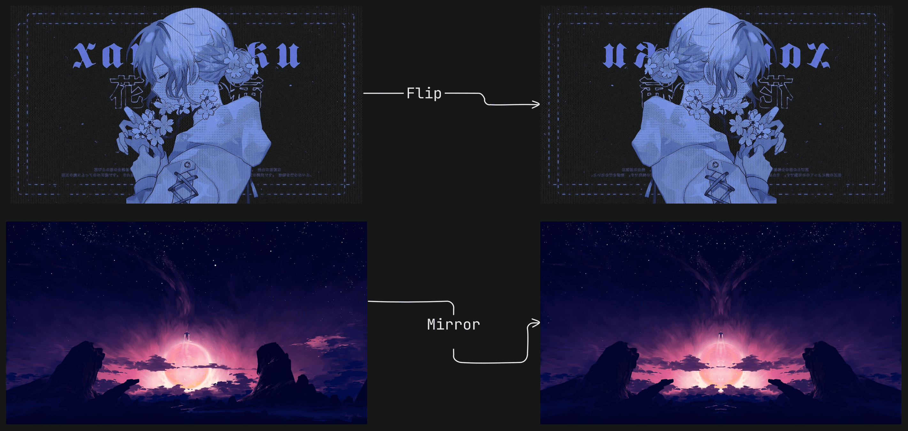

# Mirror & Flip Image

➤ `Flipping` an image essentially makes what was originally on the left side of the image now on the right.
An example is the one below where the girl is looking on the left but when you flip it, she looks on the right.

```bash
gowall effects flip ~/Pictures/girl.png
```



➤ `Mirroring` an image creates a reflection of the left side of the image onto the right. You can see the symmetry from the image
above. Notice how the clouds and rocks are symmetric?

```bash
gowall effects mirror ~/Pictures/space.png
```