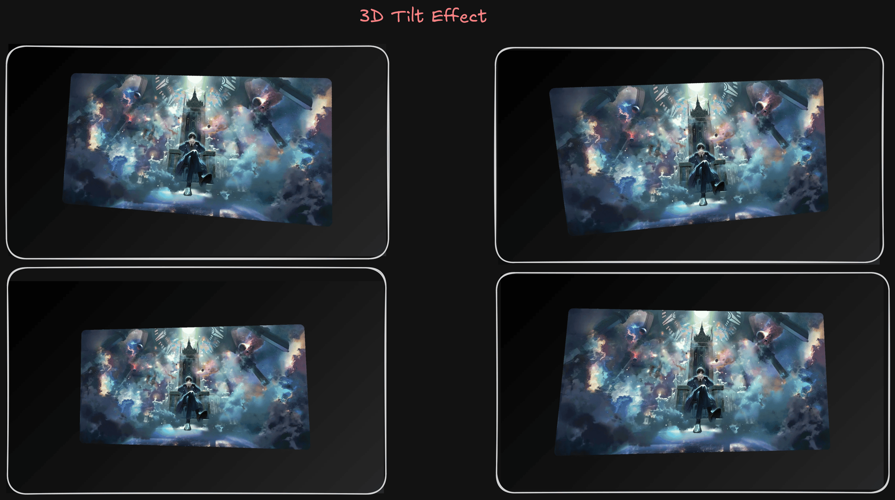
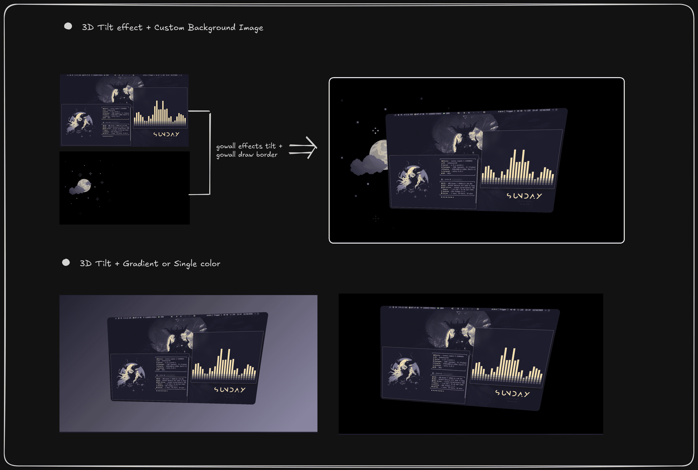

# 3D Tilt effect (New)


Gives your image that 3D tilt to one side effect. Also optionally specify the background color/gradient as well 
as corner radius if you want round corners.

I recommend using one of the 4 presets i made, though you can create your own custom tilt effect.





```bash
gowall effects tilt ~/Pictures/lotm.webp 
# Use a preset 
gowall effects tilt ~/Pictures/lotm.webp -p p1
# Use a preset and override the preset with some of your values, in this case the background gradient.
gowall effects tilt ~/Pictures/lotm.webp -p p1 -b #000000 -e #282828
# Create your own custom tilt
gowall effects tilt ~/Pictures/lotm.webp -x -10 -y 15 -z 3 -s 0.6 -r 40
# Set a custom Background image
gowall effects tilt img.png  -i bg_img.jpg -x -15


gowall effects tilt --dir ~/Pictures/Dir  --output ~/NewFolder
gowall effects tilt --batch img1.png,img2.png  --output ~/NewFolder
```


## Usage & Options

You can start from a preset (`-p`) and then override anything you want with individual flags, or skip presets entirely and set every value yourself.


➤ **Presets**  
  With `-p` `--preset` you can use one of the built‑in presets `p1`–`p4` for nice, ready-made combinations of tilt, scale, radius and background.  

- **Background gradient/color** 

  Add a background gradient via : `-b` (or `--bg-start`) and `-e` (or `--bg-end`)

  ```bash
  gowall effects tilt ~/Pictures/lotm.webp -b "#000000" -e "#282828"
  ```
  If you want it to be a solid color then simply repeat the color for both the start and end.

    ```bash
  gowall effects tilt ~/Pictures/lotm.webp -b "#000000" -e "#000000"
  ```
  
- **Custom Background Image**

  Add a custom img via : `-i` ( or `--bg-image`) 
  
  ```bash
  gowall effects tilt ~/Pictures/lotm.webp -i bg_img.png
  ```

   
- **Corner radius**  

  Specify the corner radius via : `-r` (or `--radius`) in pixels (default is `40`) for rounded corners.

- **Scale**  
  By using (`-s`, `--scale`) you can control the scale factor for the image inside the 3D view (0.1–1.0, default is `0.65`).

  > Smaller = smaller on the canvas; larger = bigger.

- **Tilt angles**  
  - `-x` / `--tiltx`: tilt on the X axis (up/down tilt), default `5` degrees  

  > Positive = top edge tilts toward you; negative = top edge tilts away.

  - `-y` / `--tilty`: tilt on the Y axis (left/right tilt), default `-8` degrees  

  > Positive = right edge tilts toward you; negative = left edge tilts toward you.

  - `-z` / `--tiltz`: rotation / Z‑axis tilt, default `3` degrees 
  
  > Positive = clockwise; negative = counterclockwise


