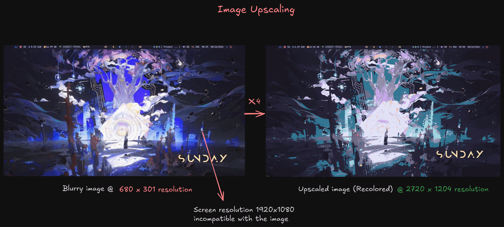
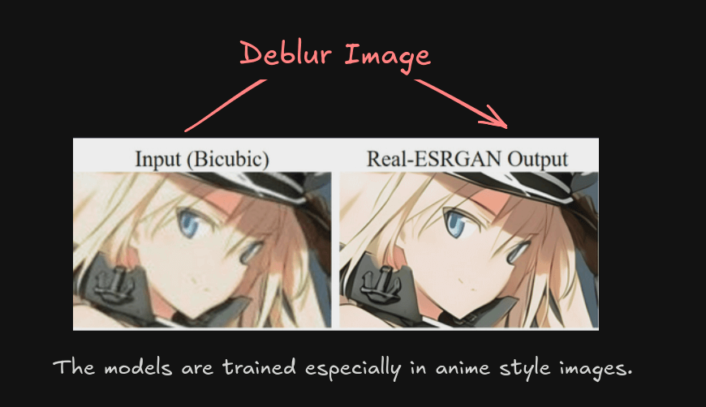

# AI Image Upscaling 


➤ Image upscaling increases the `resolution` of the image (makes it bigger) while preserving or enhancing its `quality`. 

There are 2 types of Image upscaling, the interpolation route (bilinear,bicubic interpolation) and the AI powered route (**Generative Adversarial Networks**), here we go with the second one because its a lot better.

### Prerequisites and Usage (experimental v0.2.0)

- You must have a `GPU` which supports `Vulkan` (any semi-recent GPU for example, NVIDIA GTX 1660 6GB model and all RTX cards).
- Next you have to setup the upscaler, gowall will do that automatically for you the first time you go to upscale an image, if you agree to the prompt.

```bash
gowall upscale ~/Pictures/img.png
```



The original image had `680 x 301` resolution and when trying to set it as a wallpaper with my screen being `1920x1080` it was incredibly blurry.
How to fix that? Well we will `upscale` it. Upscaling by x4 we get `2720x1204` resolution, **deblurring** the image and enabling it to be used as a wallpaper. In the example above i also recolor it in a random theme.

<br />


## Usage & Options

➤ **Scale**

The `-s` flag is the scale factor, meaning the value of which to multiply the resolution of the image. **Available Values** : 2,3,4
Here `stellar.png` has a `1024x540` resolution. Using `-s 4` we multiply the resolution by 4 so we get a `4096x2160` resolution (4K).


```bash
gowall upscale ~/stellar.png -s 4 
```
<br />

➤ **Available Models**

The `-m` flag is used to use a specific model for the upscaling. The available models are: 

- **realesr-animevideov3** (default) Really fast,optimized for anime style images.
- **realesrgan-x4plus** Slower, forces `x4` resolution better for generic style images.
- **realesrgan-x4plus-anime** a model optimized for anime style images.

```bash
gowall upscale ~/stellar.png  -s 4 -m realesrgan-x4plus
```
The reason the `realesr-animevideov3` exists is because you can get every frame of a video with `ffmpeg`, apply upscaling and rebuild it.
Though i really recommend against doing that, your GPU will be looking at you in tears and it will probably take a long time.


## Deblur Image

The models that are provided are really decent at deblurring images in anime style like the one below.
Though i don't really recommend using it for this purpose.


### ➤ `Batch & Directory conversion`

```bash
gowall upscale --batch img.png,img2.png
gowall upscale --batch img.png,img2.png --output ~/NewFolder

gowall upscale --dir ~/Pictures/Dir
gowall upscale --dir ~/Pictures/Dir --output ~/NewFolder
```


## Warning & Known Issues
:::warning
- If you get a black image with red lines after a long time of processing then most likely your GPU does not support `Vulkan`.
- This feature has not been tested on `MacOS`, do not be surprised if isn't working as expected.
:::

## License

This feature would not have been possible without `Xintao Wang`, thank you for Real-ESRGAN

Real-ESRGAN ncnn Vulkan

Copyright © 2021 Xintao Wang

Permission is hereby granted, free of charge, to any person obtaining a copy of this software and associated documentation files (the “Software”), to deal in the Software without restriction, including without limitation the rights to use, copy, modify, merge, publish, distribute, sublicense, and/or sell copies of the Software, and to permit persons to whom the Software is furnished to do so, subject to the following conditions:

The above copyright notice and this permission notice shall be included in all copies or substantial portions of the Software.

THE SOFTWARE IS PROVIDED “AS IS”, WITHOUT WARRANTY OF ANY KIND, EXPRESS OR IMPLIED, INCLUDING BUT NOT LIMITED TO THE WARRANTIES OF MERCHANTABILITY, FITNESS FOR A PARTICULAR PURPOSE AND NONINFRINGEMENT. IN NO EVENT SHALL THE AUTHORS OR COPYRIGHT HOLDERS BE LIABLE FOR ANY CLAIM, DAMAGES OR OTHER LIABILITY, WHETHER IN AN ACTION OF CONTRACT, TORT OR OTHERWISE, ARISING FROM, OUT OF OR IN CONNECTION WITH THE SOFTWARE OR THE USE OR OTHER DEALINGS IN THE SOFTWARE.