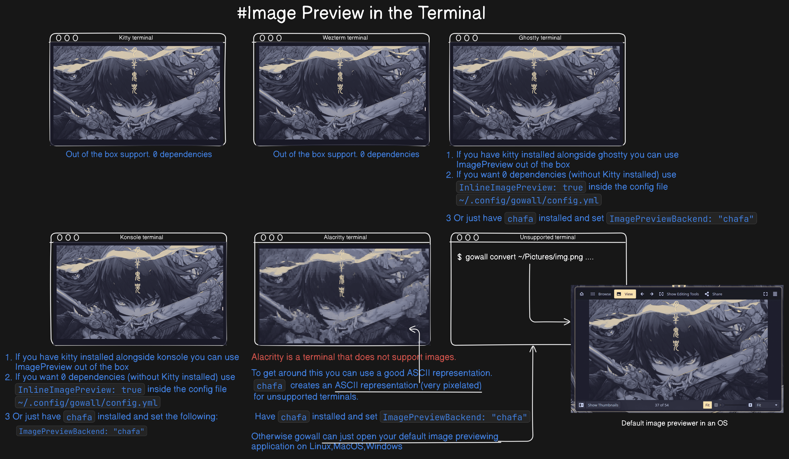

# Introduction (Important)

## What is gowall?

Gowall is a CLI and started as a way to convert images ( specifically wallpapers ) to your favourite color scheme ex. catppuccin,everforest,solarized ...  Since then, Gowall has evolved significantly, and I’ve transformed it into a versatile Swiss Army knife for a variety of cool image processing tasks.


## Gowall's Features explained quickly

❗ Gowall although a CLI has an `Terminal Image preview` feature, you can see the next section for more information.

- Convert Wallpaper's theme 👾 – Recolor an image to match your favorite + (Custom) themes (Catppuccin...)
- AI Image Upscaling  - Increase the resolution of the image while preserving or improving its quality.
- Image compression - Reduce the size of png,jpeg,jpg,webp images.
- OCR (Optical Character Recognition) - Extract text from images and pdfs', supporting a lot of providers.
- Support for Unix pipes/redirection - Read from `stdin` and write to `stdout`
- Convert Icon's theme (svg,ico) - Recolor your icons to match a theme
- Image to pixel art - Transforms your image to the typical blocky appearance of pixel art.
- Replace a specific color in an image - pretty self explanatory.
- Create a gif from images - use the images as frames and specify a delay and the number of loops.
- Extact color palette - Extracts all the dominant colors in an image (like pywal)
- Change Image format - Ex. change format from `.webp` to `.png`.
- Invert image colors - pretty self explanatory.
- Draw on the Image - Draw borders,grids on the image
- Remove the background of the image - pretty self explanatory.
- Effects - Mirror,Flip,Grayscale,change brightness and more to come!
- Daily wallpapers - Explore community-voted wallpapers that reset daily.

## Image preview



Gowall  supports  `image preview`  by printing the image on the following terminals, or opening your default image viewing app.

<details>
  <summary><strong>Kitty</strong></summary>

 ➤ Image previewing on Kitty works out of the box 0 dependencies.  

 ➤ You can always install & use `chafa` if you like for a small increase in speed but worse resizing.  
   Set `ImagePreviewBackend: "chafa"` inside `~/.config/gowall/config.yml`
</details>

<details>
  <summary><strong>Wezterm</strong></summary>

 ➤ Image previewing on Wezterm works out of the box 0 dependencies, just make sure that your `.wezterm.lua` has these settings:

 ```lua
 local wezterm = require 'wezterm'

local config = wezterm.config_builder()

config = {
  enable_kitty_keyboard = true,
  enable_kitty_graphics = true,  
}

return config
 ```

 ➤ You can always install & use `chafa` if you like for a small increase in speed but worse resizing.  
   Set `ImagePreviewBackend: "chafa"` inside `~/.config/gowall/config.yml`
</details>

<details>
  <summary><strong>Ghostty & Konsole</strong></summary>

 ➤ Your first option is to have `kitty` installed alongside Ghostty/(Konsole). Then it will work out of the box.

 ➤ Your second option **(0 dependencies)** is to just set `InlineImagePreview: true` since gowall supports the kitty protocol directly.

 ➤ Your third option is to install & use `chafa` by setting `ImagePreviewBackend: "chafa"` inside `~/.config/gowall/config.yml`
 
</details>


<details>
  <summary><strong>Terminals that don't support images (Alacritty) or those who use the Sixel Protocol</strong></summary>

 ➤ If your terminal only supports `Sixel` your only option is to install & use `chafa` by setting `ImagePreviewBackend: "chafa"` inside `~/.config/gowall/config.yml`

 ➤ If the terminal does not support images in any way like a certain someone (**Alacritty**) you have 2 options :
  - Use `chafa` and get a very decent ASCII representation in the terminal. 
  - Don't do anything and just let gowall open your `default image previewer on any operating system`. (See the image on the bottom right)
 
</details>

`Image preview` is `ON` by default. You can disable it by adding the following inside your `~/.config/gowall/config.yml` 

   ```yaml title="~/.config/gowall/config.yml"
   EnableImagePreviewing: false
   ```

## Shell completions

### What are completions?

in cli's completions help you finish typing commands and their options (flags,subcommands) quickly by pressing `[TAB]`,for example 

```bash
gowall [TAB] 
```
would show you the options below

```
Available Commands:
  bg          Removes the background of the image
  completion  Generate the autocompletion script for the specified shell
  convert     Convert an img's color scheme
  draw        draw a border with a color and thickness (currently)
  extract     Returns the color pallete of the image you specificed (like pywal)
  help        Help about any command
  invert      Inverts the color's of an image
  list        Lists available themes
  pixelate    Turns an image to pixel art depending on the scale flag

Flags:
  -h, --help      help for gowall
  -t, --toggle    Help message for toggle
  -v, --version   show gowall version
  -w, --wall      fetches the wallpaper of the day!
```
<br />
### How do i add shell completions?

Shell completions are available for `zsh` `bash` `fish` `powershell`. Lets see how to add `zsh` shell completions, all the other can be added the same way.

Generate the completion and save it as `_gowall`
```bash
gowall completion zsh > ~/_gowall
```
Add the following  to your `.zshrc` to make sure zsh can use shell completions
```bash title=".zshrc"
fpath=(~/ $fpath)

autoload -Uz compinit
compinit
```

Lastly source your `.zshrc`
```bash
source ~/.zshrc
```

