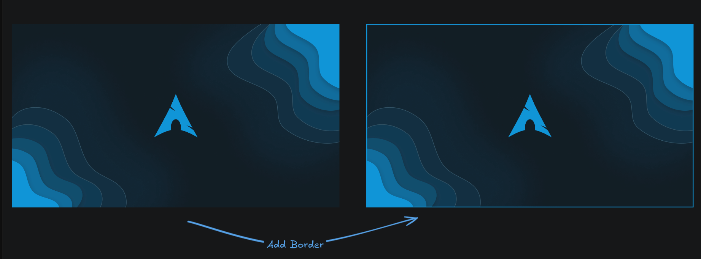
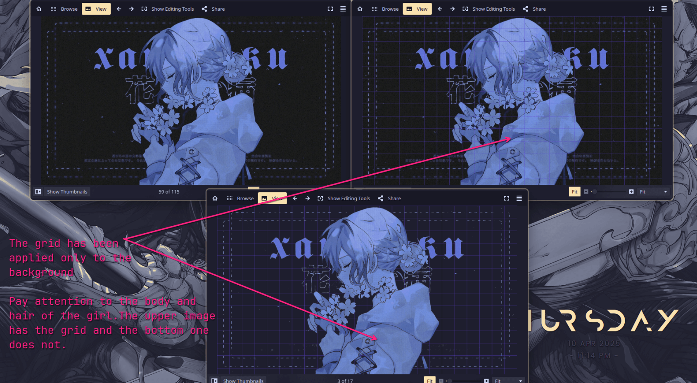

# Draw on the Image

## Add a border

    The below draws a border 5px thick with the color #5D3FD3

    ```bash
gowall draw border ~/Pictures/img.png -c #5D3FD3 -b 5
gowall draw border ~/Pictures/img.png -c #5D3FD3 -b 5 --output ~/NewFolder/newName.png
    ```


##### ➤  `Batch conversion`
    ```bash
gowall draw border --batch img.png,img2.png -c #5D3FD3 -b 5
gowall draw border --batch img.png,img2.png -c #5D3FD3 -b 5 --output ~/NewFolder
    ```

##### ➤  `Directory conversion`
    ```bash
gowall draw border --dir ~/Pictures/Dir -c #5D3FD3 -b 5
gowall draw border --dir ~/Pictures/Dir -c #5D3FD3 -b 5 --output ~/NewFolder
    ```

## Add a grid

Add some spice to your image by drawing a grid. You can also 

```bash
gowall draw grid ~/Pictures/img.png 
gowall draw grid ~/Pictures/img.pmg -c "#FFFFFF" -s 80
gowall draw grid ~/Pictures/img.png -m true --output ~/Pictures/ # go read about the `-m` flag below
```



You can draw a grid on the image and customize it via the following flags :

- `-c` the color of the grid ex. `#5D3FD3`
- `-s` the size of the grid  ex. `80`
- `-t` the thickness of the grid lines ex. `1`
- `-m` this is the maskonly flag. It will apply the grid only to transparent pixels. Essentially imagine that you removed the background of an image with `gowall bg` and now it has transparent pixels, using the `-m` flag it will apply the grid only to the background. (Like the 3rd image on the bottom of the visual example ).

Here is a 1-liner on how to do that : 

```bash
gowall bg img.png - | gowall draw grid - -m true --output ~/Pictures/gowall/new.png
```

##### ➤  `Batch & Directory conversion`
    ```bash
gowall draw grid --batch img.png,img2.png 
gowall draw grid --batch img.png,img2.png --output ~/NewFolder
gowall draw grid --dir ~/Pictures/Dir 
gowall draw grid --dir ~/Pictures/Dir --output ~/NewFolder
    ```


<br />
## Create Solid color & Gradient Images

Under construction...🔨 (Next update?) 

<br />
## Create Images out of Shapes

Under construction...🔨 (Next update?) 