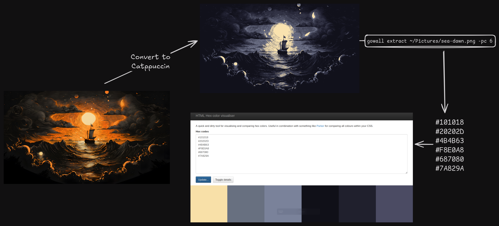

# Extract color palette of an Image

So you want to know the dominant colors of an image? extract them with : 

    ```bash
    gowall extract /path/to/img.png -c 6
    ``` 

The `-c` flag is the `colors` flag it specifies how many hex color codes to return ( i recommend 6-16).
The above will print the color codes to the terminal. In order for you to view all the colors of the hex codes at once you can use the `-p` flag.

    ```bash
    gowall extract /path/to/img.png -pc 6
    ```
That will open a hex color previewer in your `default web browser`, simply copy the hex colors from the terminal over there.


:::tip
If your image consists of lets say 1 color (blue) and you try to extract more colors with  `gowall extract /path/to/img.png -c 3`,
then it will return the 1 true color (blue) and produce another 2 shades of blue.
:::


## Examples


