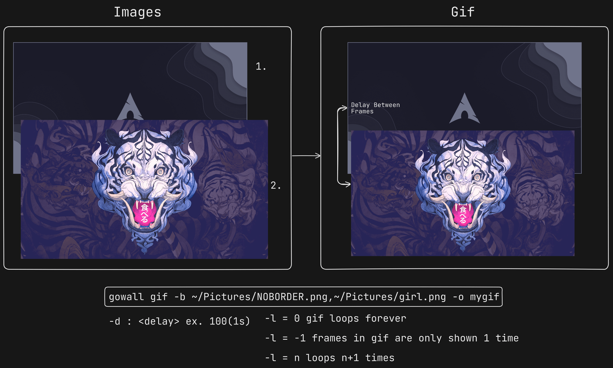

# Create a Gif from Images

➤ Creates a gif from images. You specify all the path to the images you want to create a gif for with `,` as the seperator. 
If you dont specify any flags the defaults are set so it loops forever and it has a 2 second delay between frames.

```bash
gowall gif -b ~/Pictures/NOBORDER.png,~/Pictures/girl.png 
```
:::note 
Do not leave any spaces between the path to the images.The `-b` flag is necessary 
:::




### Delay between Frames

To change the delay between the frames you can use the `-d` flag followed by an integer. 100 is 1 second.

```bash
gowall gif -b ~/Pictures/NOBORDER.png,~/Pictures/girl.png -d 100
```

### Loops of the frames

The `l` flag is used to specify the number of loops to show the frames of the gif.

1. `l=0` If you want the frames of your gif to show forever (default). 
2. `l=-1` If you only want to show the frames of your gif only once.
3. `l=n` This will show the frames of the gif n+1 times.


```bash
gowall gif -b ~/Pictures/NOBORDER.png,~/Pictures/girl.png -l -1
```