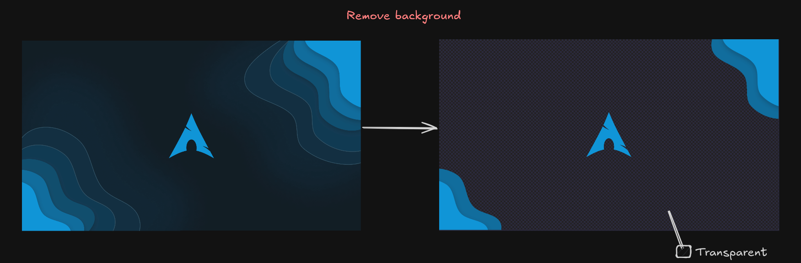

# Remove Background of an Image

Remove the background of an image (Experimental! ***v1.9***).  

    ```bash
    gowall bg ~/Pictures/img.png
    ``` 
You also have a bunch of options to play around with for more control.


:::note
 This algorithm will be refined over time to give better results as i implemented it from scratch.
:::

## Examples



## More control

`-c` is the convergance flag (default 0.001).   
`-i` is the iterations flag (default 100). Increasing this value will make the removal take longer but might rarely do a better bg removal.  
`-r` is the goroutines flag (default 4). Increasing it will increase speed and utilize your CPU more.  
`-s` is the sample rate flag (default 0.5). By inc/decr this value you can influence the speed and quality background removal.

You can combine them together to control the parameters of the background removal.
```bash
    gowall bg ~/Pictures/img.png -r 10 -s 0.8
```