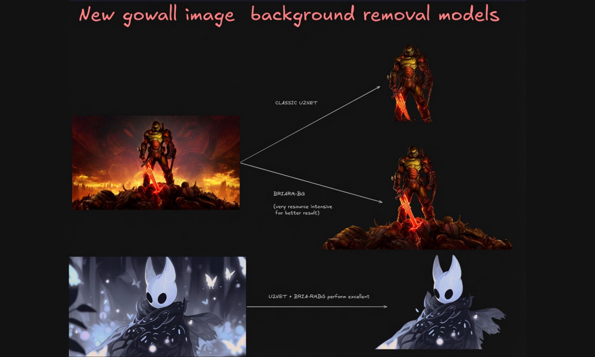
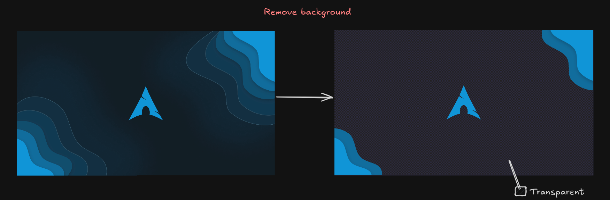

# Remove Background of an Image (Improvement)

Remove the background of an image. By default the `u2net` model is used as of `v0.2.4`.
For configuration of `onnx` folder of the shared `onnxruntime` lib or the models see the section


```bash
gowall bg ~/Pictures/img.png
gowall bg ~/Pictures/img.png -m u2net --bg-color "#ffffff"
gowall bg ~/Pictures/img.png --output ~/NewFolder/img2.png
``` 





### ➤ **Available Models**

Available models can be selected via the `-m` or `--method` flag:

- `u2net` (default)
- `bria-rmbg` (resource intensive but SOTA on removing a background)
- `kmeans` (medium-to slow, mostly used to achieve unique remove background removals)

```bash
gowall bg ~/Pictures/img.png -m u2net
```

CUDA support will be added for the models via the `onnxruntime` in a future release. Currently `only CPU` is supported.

On the above image with the Doom guy and the Hollow knight the `u2net` and `bria-rmbg` models are used. Below is an example of the `kmeans` model being used.



### ➤ **Configure onnx runtime/model folders**

By default gowall just asks you a confirmation `y/n` and it simply setups up everything itself and saves everything inside `~/.u2net`. 

If you wish to change the folder where the onnx models or runtime are read from or being downloaded to then you can simply do so : 

```bash title="~/.config/gowall/config.yml"
OnnxRuntimeFolderPath: "~/.mycustomfolder"
OnnxModelFolderPath: "~/.mycustomfolder"
```
- This also allows `NixOS users` to bypass the NixOS `cant run dynamically linked executables` by downloading `onnxruntime` themselves and simply pointing the `.so` library to gowall by the config

- Also helps if you downloaed `.onnx` background removal models before you can just point gowall to the folder so it doesnt have to re-download them.


### ➤ **Background Color**

The `--bg-color` flag can be used to make the removed background another color instead of being transparent. In the below example the background is made white.

```bash
gowall bg img.png -bg-color "#ffffff"
```


### ➤  `Batch conversion`

Do not try to use this with `bria-rmbg`, its a heavy model and needs a lot of resources.
You could always use `u2net` instead.

    ```bash
gowall bg --batch img.png,img2.png
gowall bg --batch img.png,img2.png --output ~/NewFolder
    ``` 


### ➤  `Directory conversion`

Do not try to use this with `bria-rmbg`, its a heavy model and needs a lot of resources.
You could always use `u2net` instead.


    ```bash
gowall bg --dir ~/Pictures/Dir
gowall bg --dir ~/Pictures/Dir --output ~/NewFolder
    ``` 

## `-m kmeans` other flag parameters for more control

The following flags only affect the `kmeans` model.

```bash
gowall bg ~/Pictures/img.png -m kmeans 
```

`-c` is the convergance flag (default 0.001).   
`-i` is the iterations flag (default 100). Increasing this value will make the removal take longer but might rarely do a better bg removal.  
`-r` is the goroutines flag (default 4). Increasing it will increase speed and utilize your CPU more.  
`-s` is the sample rate flag (default 0.5). By inc/decr this value you can influence the speed and quality background removal.

You can combine them together to control the parameters of the background removal.
```bash
gowall bg ~/Pictures/img.png -m kmeans -r 10 -s 0.8
```