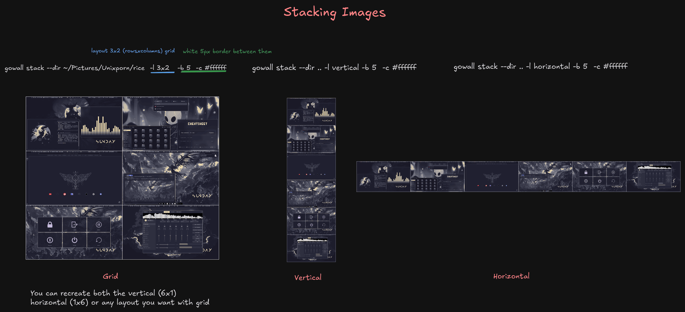

# Stack images into a grid (New)

Stack images in any way you want, seperate them with a border of your color and pixel size.

- You want to create a 3x3 grid to fit your images? cool. 
- You want to stack 2 images vertical or horizontal? sure.
- Combine the above for even more complex layouts.




```bash
gowall stack --dir ~/Pictures/Unixporn/rice -l 3x2 -b 5 -c "#ffffff"
gowall stack --batch img1.png,img2.png,img3.png -l 3x1 -b 5 -c "#ffffff"

gowall stack --dir ~/Pictures/Unixporn/rice -l 3x2 -b 5 -c "#ffffff" --output ~/NewFolder
```


## Usage & Options

➤ Layout 

The `-l` (or `--layout`) flag controls the layout of the images.

* Values : 
    * `MxN` where M is the number of images per row and N is the number of rows.
    * `horizontal` just stacks the images horizontally.
    * `vertical` just stacks the images vertically. (default)

    You can combine the grid and the horizontal/vertical stacking together to create really complex layouts.

If you use something like `3x2` your max amount images is 6 but you can use less images and the empty cells will become transparent except their border.

```bash
# This grid can accommodate up to 10 images. Empty grid cells just become transparent except their border
# If our directory here has 10 images it will create a perfect grid.
gowall stack --dir ~/Pictures/screenshots -l 2x5
```


➤ Border color 

The `-c` (or `--color`) flag controls the color that fills the borders together with its color

```bash
gowall stack --dir ~/Pictures/Unixporn/rice -l 3x2 -b 5 -c "#ffffff"
```

➤ Border thickness 

The `-b` (or `--border`) flag controls the thickness of the empty space **between** images and around the **outer edge** of the grid.

* Values : 
    * Any positive integer. The value is in **pixels**.

```bash
gowall stack --dir ~/Pictures/wallpapers -l 4x2 -b 5 -c "#ffffff"
```

➤ Resize

The `-r` (or `--resize`) flag is used to control when resize applies.

* Values : 
    * `off` : Doesnt do any resizing. (default)
    * `biggest` : resizes all images down to match the smallest image's dimensions

```bash
gowall stack --dir ~/Pictures/wallpapers -l 4x2 -b 5 -c "#ffffff" -r biggest
```
