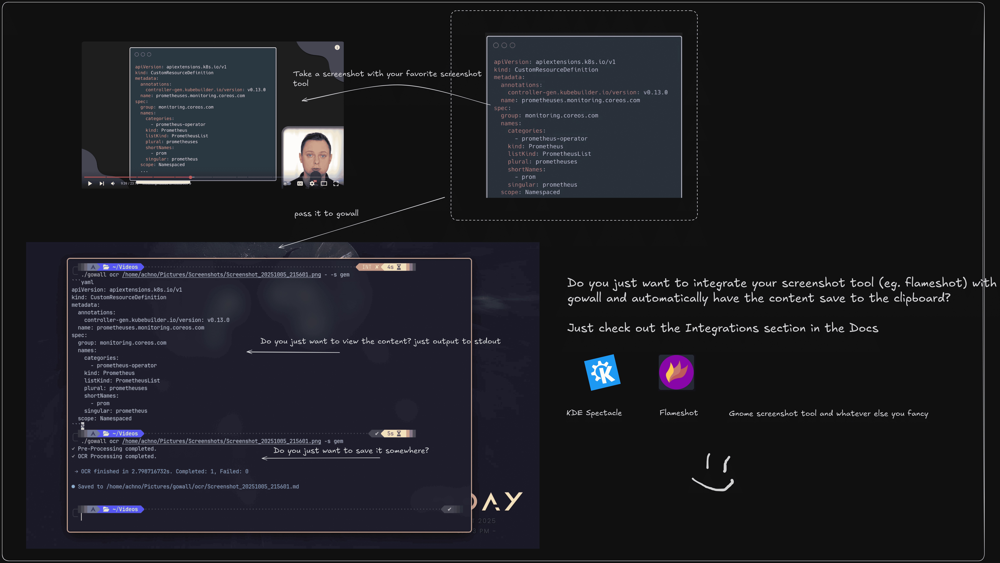

# Visual Examples & Use Cases


## Code snippets

There's me, just lying on my bed watching a k8s video on youtube. The guy puts a code snippet on the screen.
How was i supposed to copy this to my vault(notes)? Well, this is one of the reasons i added OCR to gowall.

Especially with how easy it is to [combine `gowall` and any screenshot utility](./intergrations.md) (i like `flameshot` even on wayland)




## Small Pdf's or lots of Images

At the time of writing this, like 4 months ago i was studying for my exams and on discord there were pinned examples of past exams i wanted to solve. These were all images basically (some people made pdf's that grouped all the images inside though), so i downloaded all of them put them in a folder and used `gowall` so i can put them in my notes.

```
# gotta love bulk ocr dont ya
gowall ocr --dir ~/MyExams -s gem --output ~/MyExams/notes.md
```

## Bypassing file upload limits on LLM sites

Obviously while i was studying for exams i reached the limits on all llm sites for uploading files, following the example above, i just ocred the images of the past exams, just uploaded the text each time  and could discuss it with all of the llm's i wanted to see what they have to say, and for me to think things through and finalize an answer.

This effectively bypasses file upload limits, while i still got what i wanted.


---

I can keep rumbling about my needs for OCR, like converting scanned documents (nah defenitly not scanned textbooks, mr undergraduate student over here can defenitly toss out a bunch of money for textbooks which cost 3 months of food, yea im angry if you haven't noticed ) but i will wrap it up here.

If you want to support this poor student who put up such comprehensive documentation for you (very time consuming trust me, its all handwritten anyway), you can donate  5 euros so i can buy a whole cooked chicken, here is my kofi : https://ko-fi.com/achnologia