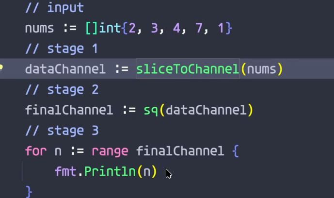

# Tesseract Provider


## Prerequisites

You must have `tesseract` installed along with language packs. For example in **Arch Linux**

```sh
yay tesseract

3 extra/tesseract-data-ben 2:4.1.0-4 (1.3 MiB 1.7 MiB) [tesseract-data]
    Tesseract OCR data (ben)
2 extra/tesseract-data-jpn 2:4.1.0-4 (14.1 MiB 34.0 MiB) [tesseract-data]
    Tesseract OCR data (jpn)
1 extra/tesseract 5.5.1-1 (1.6 MiB 4.6 MiB) (Installed) <-----------
    An OCR program

# language packs
102 extra/tesseract-data-eng 2:4.1.0-4 (9.0 MiB 22.4 MiB) [tesseract-data] (Installed) # english
35 extra/tesseract-data-ell 2:4.1.0-4 (3.0 MiB 7.2 MiB) [tesseract-data] (Installed) # greek
```


## Most Basic Schema

```yaml title="~/.config/gowall/schema.yml"
schemas:
  - name: "tes"
    config:
      ocr:
        provider: "tesseract"
        model: "tesseract"
```

```bash
gowall ocr img.png -s tes
```
Please refer to the [schemas](../schema.md) section for more information on how to use schemas with rate limiting,pre/post processing options,text correction etc...


## Tesseract + LLM Grammar/Format Correction

You can checkout the [text correction example](../schema.md#text-correction) in the schema section where it showcases how tesseract does the OCR and the LLM corrects the grammar mistakes, closes brackets etc...

**Example**

Take the below image for example, lets compare the plain tesseract output and the tesseract + LLM corrected output of the extracted text.


| Specimen |  
| --- |
|  | 

```
gowall ocr img.png -p tesseract -m tesseract 
```

```bash title="Plain Tesseract output"
// input

nums := [lint{2, 3, 4, 7, 1}

// stage 1

dataChannel := sliceToChannel(nums)

// stage 2

finalChannel := sq(dataChannel)

// stage 3

for n := range finalChannel {
fmt.Println(n)

```

As we can see Tesseract did several mistakes : 

1) instead of `[]int` it used `[lint`, hell it didn't even bother to close the brackets.
2) There is a missing closing bracket `}` at the end in the for range loop.
3) the `for n:= and the fmt.Println()` are in the same vertical line, which isn't correct since the println should be one tab in.


Lets try the tesseract + LLM corrected output, to see what exactly changes now that tesseracts output is given to a model.

```bash
gowall ocr img.png -s tes-llm
```

````s title="Tesseract + LLM corrected output"

```go
// input

nums := []int{2, 3, 4, 7, 1}

// stage 1

dataChannel := sliceToChannel(nums)

// stage 2

finalChannel := sq(dataChannel)

// stage 3

for n := range finalChannel {
    fmt.Println(n)
}
```

````

Seems that things are a lot better now.

1) The model knows go so it infered from the syntax and context that it should be `[]int` not `[lint`.
2) Actually closed the brackets `}` at the end in the for range loop.
3) the `for n:= and the fmt.Println()` are now in the correct vertical line.

4) It even threw a little bonus wrapping the code inside a markdown code block and adding a language tag.

The above was done with the following schema : 

```yaml title="~/.config/gowall/schema.yml"
  - name: "tes-llm"
    config:
      ocr:
        provider: "tesseract"
        model: "tesseract"
      text_correction:
        enabled: true
        rate_limit:  # <-- rate limits the post-processing provider not the ocr provider
            rps: 2
            burst: 4
        provider:
          provider: "openrouter"  # You can specify all the provider configs as seen in the 'Provider Configs' section
          model: "x-ai/grok-4-fast:free"
```
Obviously here is where a selfhosted llm could come to play for grammar correction, since you don't need beefy specs to run a simple model for this task. The example above is just for demonstration purposess.