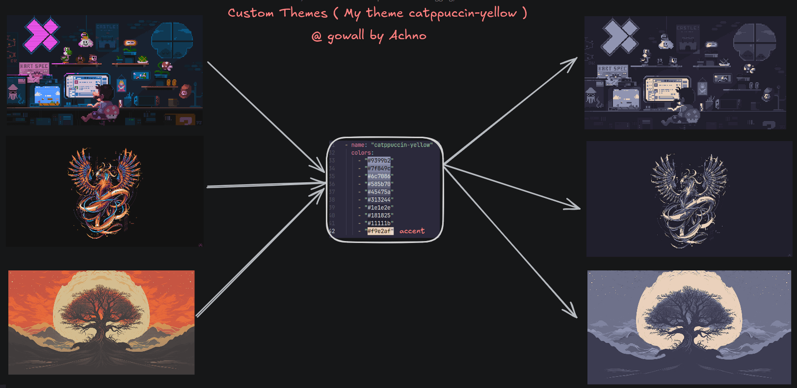

# Themes 

The currently supported themes are featured below, if your favourite theme is missing open an issue or a pull request

All themes can be shown (both default and user-created via `~/.config/gowall/config.yml`) by `gowall list`

- **Catppuccin Mocha**
- **Nord**
- **Everforest**
- **Solarized**
- **Gruvbox**
- **Dracula**
- **Tokyo-dark/storm/moon**
- **Onedark**
<details>
  <summary><strong>Click to see more themes</strong></summary>
  
  - **Material**
  - **Atom One Light**
  - **Sweet**
  - **Synthwave 84**
  - **Atom Dark**
  - **Oceanic Next**
  - **Shades of Purple**
  - **Arc Dark**
  - **Sunset Aurant**
  - **Sunset Saffron**
  - **Sunset Tangerine**
  - **Cyberpunk**
  - **Night Owl**
  - **Github Light (black & white)**
  
</details>


<br />


## Create your own Theme 



Step 1. Create the directory and file : `~/.config/gowall/config.yml`

Step 2. Paste the below template and change the name and hex values for your theme

```yml
themes:
  - name: "placeholder1"
    colors:
      - "#F5E0DC"
      - "#F2CDCD"
      - "#F5C2E7"
      - "#CBA6F7"
      - "#F38BA8"
      - "#EBA0AC"
      - "#FAB387"
      - "#F9E2AF"
      - "#A6E3A1"
      - "#94E2D5"
      - "#89DCEB"
      - "#74C7EC"
      - "#89B4FA"
      - "#B4BEFE"
      - "#CDD6F4"
      - "#BAC2DE"
      - "#A6ADC8"
      - "#9399B2"
      - "#7F849C"
      - "#6C7086"
      - "#585B70"
      - "#45475A"
      - "#313244"
      - "#1E1E2E"
      - "#181825"
      - "#11111B"
  - name: "placeholder2"
    colors:
      - "#F73253"
      - "#FA39DF"
      - "#005382"
      - "#123456"
```
Notes 🗒️ :

:::info
- Duplicate theme names will not be loaded
:::

### Community Themes 🌐

Themes that were requested by the community and added to `gowall`

- **Srcery**

## List all Themes & all colors of the Theme

List all available themes for you to convert your image to via : 

   ```bash
    gowall list
   ```
You can view the colors of a theme by using the `-t` flag. The below will print all the colors of the catppuccin theme.Example:
   ```bash
    gowall list -t catppuccin
   ```

You can also open up a hex color preview app in your default browser via the `-p` flag. 
   
   ```bash
    gowall list -pt catppuccin
   ```

